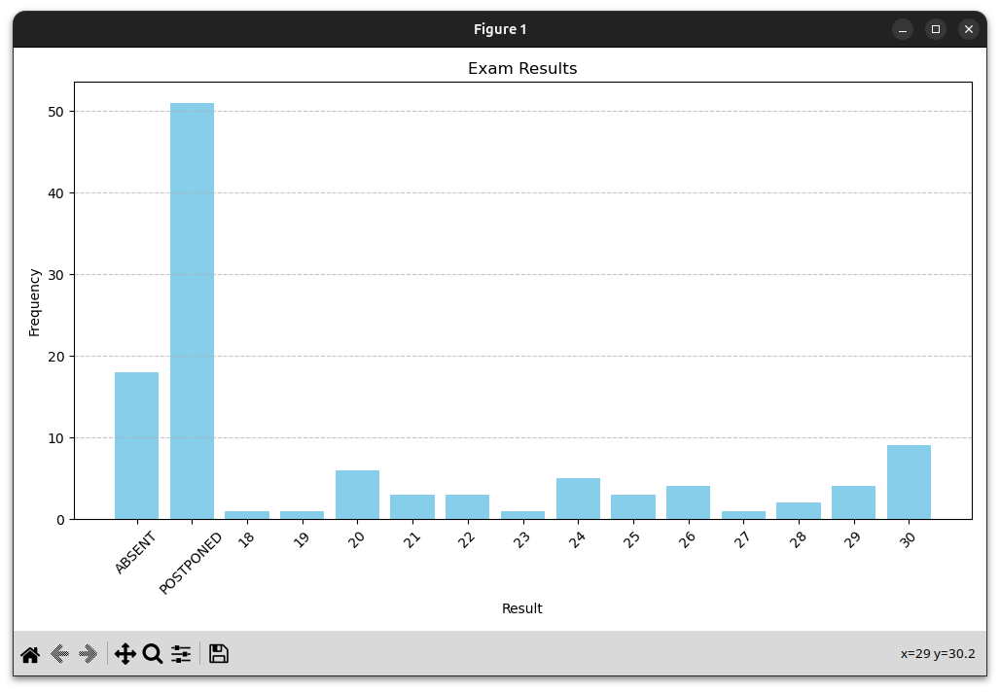

# Grades Analyzer
This Python script analyzes and visualizes exam results from a text file.

## Requirements
- Python 3.x
- matplotlib

You can install the required package with:
```bash
pip install matplotlib
```

## Input File Format
The script expects an input file named `prova.txt` in the same directory. Each line should contain at least two elements, where the second element is either a grade (integer) or a keyword:

```
Name 28
Name2 ABSENT
Name3 22
Name4 POSTPONED
Name5 17
```

Supported keywords (case-sensitive):
- `RIMANDATO`, `POSTPONED` (counted as 0)
- `ASSENTE`, `ABSENT` (counted as -1)
- `NON`, `NOT` (counted as -2)

## Usage
Run the script with:
```bash
python3 gradesanalyzer.py
```

This will display a bar chart of the results and print the average of valid grades (grades >= 18) to the console.



## License
MIT License # Grades-Analyzer
